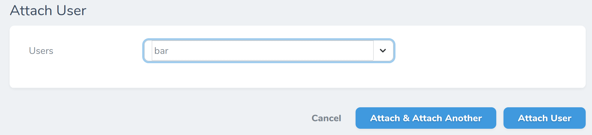
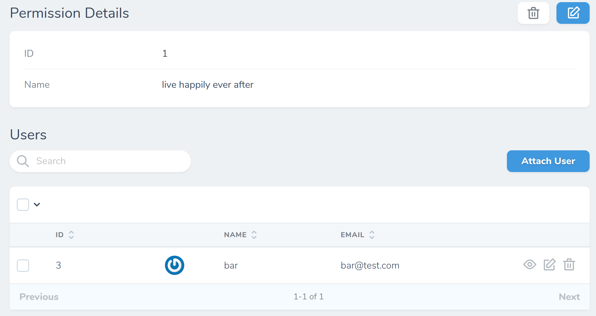
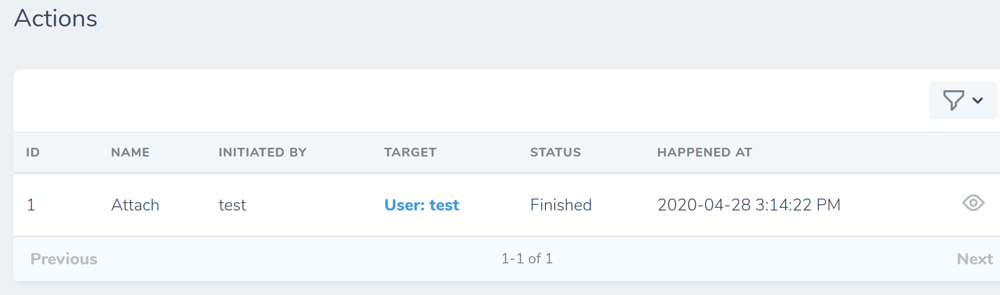
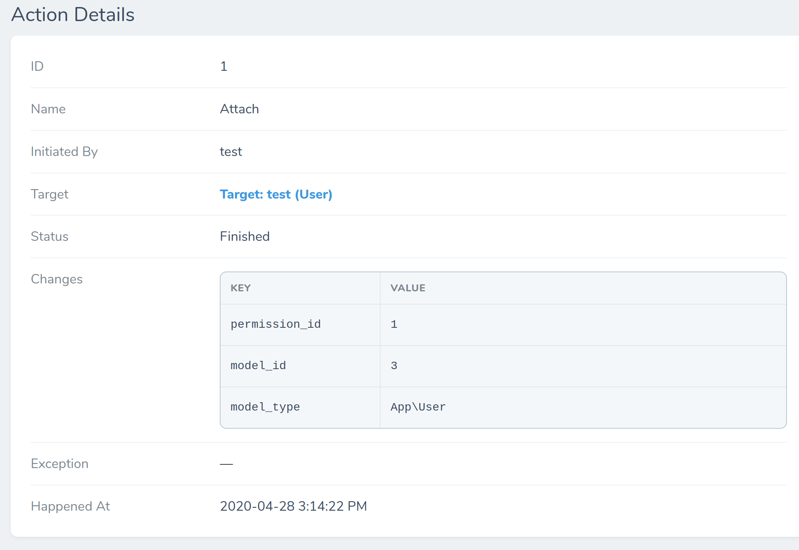

# Reproduce laravel/nova-issues #1959

See [#1959](https://github.com/laravel/nova-issues/issues/1959) / [#2106](https://github.com/laravel/nova-issues/issues/2106)

## Steps

1. `composer install`
2. `cp .env.example .env`
3. `docker-compose up`
4. Visit http://localhost/nova
5. Login with username `test@test.com`, password `test`
6. [Go to the "live happily ever after" permission page](http://localhost/nova/resources/permissions/1)
7. Attach that permission to the user "bar":

8. [Visit the "Action Events" page](http://localhost/nova/resources/action-events):

9. You should see "Target: User: test", even though you targeted "bar". The proper "bar" user _was_ properly attached:

